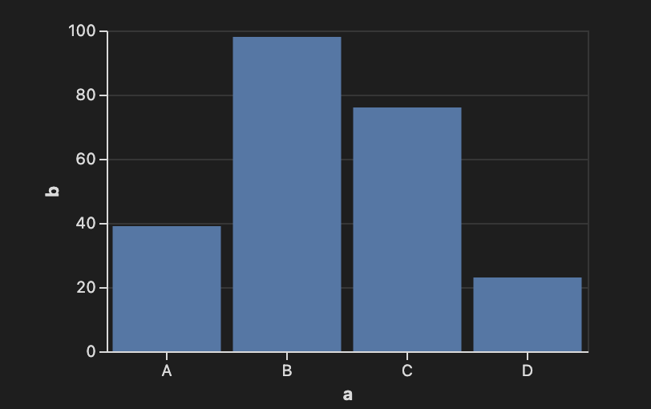
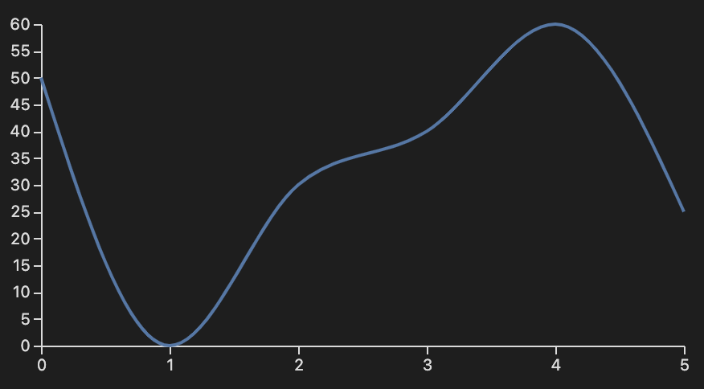

# Obsidian Vega

Create highly customizable data visualizations using Vega or Vega-Lite specifications written in JSON format. Additional documentation can be found at the Vega website for formatting [Vega specifications](https://vega.github.io/vega/docs/) and [Vega-Lite specifications](https://vega.github.io/vega-lite/docs/). 

To add a chart or plot, create a code block with `vega` or `vega-lite` as the language and add the JSON specification.

## Examples

### Bar Chart using Vega-Lite

~~~markdown
```vega-lite
{
  "width": 300,
  "data": {
    "values": [
      {"a": "A", "b": 39}, {"a": "B", "b": 98},
      {"a": "C", "b": 76}, {"a": "D", "b": 23}
    ]
  },
  "mark": "bar",
  "encoding": {
    "x": { "field": "a", "type": "nominal", "axis": { "labelAngle": 0 } },
    "y": { "field": "b", "type": "quantitative" }
  }
}
```
~~~



### Line Chart Using Vega

~~~
```vega
{
  "width": 400,
  "height": 200,
  "data": [
    {
      "name": "table",
      "values": [
        { "x": 0, "y": 50 }, { "x": 1, "y": 0 },
        { "x": 2, "y": 30 }, { "x": 3, "y": 40 },
        { "x": 4, "y": 60 }, { "x": 5, "y": 25 }
      ]
    }
  ],
  "scales": [
    {
      "name": "x",
      "type": "point",
      "range": "width",
      "domain": { "data": "table", "field": "x" }
    },
    {
      "name": "y",
      "type": "linear",
      "range": "height",
      "domain": { "data": "table", "field": "y" }
    }
  ],
  "axes": [
    { "orient": "bottom", "scale": "x" },
    { "orient": "left", "scale": "y" }
  ],
  "marks": [
    {
      "type": "line",
      "from": { "data": "table" },
      "encode": {
        "enter": {
          "x": { "scale": "x", "field": "x" },
          "y": { "scale": "y", "field": "y" },
          "interpolate": { "value": "monotone" }
        }
      }
    }
  ]
}
```
~~~


